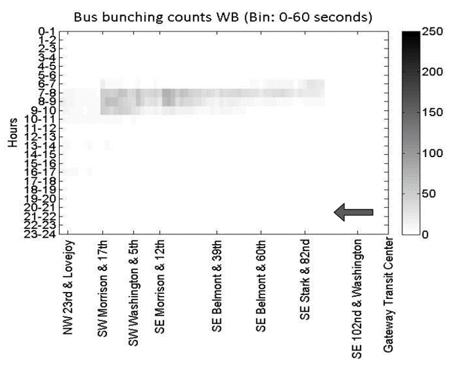

# Assignment 1: Project Proposal
## Spatio-Temporal Mapping of Bus Bunching with Real-Time GTFS

#### Topic

I am interested in exploring GTFS data and how to use APIs to request static and real-time data. GTFS, which stands for General Transit Feed Specification, is a standardized data format used by transit agencies to publish their stops, routes, trips, and other schedule data. The format was originally created by programmers at Google working to get transit schedules and geographic information into Google Maps. The format gained popularity among developers and is now widely available. By publishing schedule information in a digestible format, it allows easy data operability though an applied programming interface (API).

My focus in the MCP program at Berkeley is in transportation planning, so I am excited to work with GTFS data because it will give me experience working with a dataset that planners frequently use. I have worked with route, stop, and trip files in ArcGIS to manually map bus routes but want to create replicable code with the same data. I do not have experience with real-time data, so this project will be a fun challenge because it will require data collection in addition to manipulation.

My project will focus on how to use real-time GTFS data to identify bus bunching. Bus bunching is a phenomenon that occurs when a bus gets delayed. Once the bus is behind schedule there are more people waiting at the next stop, which further delays the bus. This continues down the route, and if there is enough delay and short enough headway the bus behind catches up. Instead of being evenly spaced the buses are now platooning, resulting in unreliable service (“Bus Bunching Explained Visually”). 

There is plenty of literature about bus bunching, which falls into two general categories. The first is modelling bus bunching and identifying causes. A study by Feng and Figliozzi, 2011 used real bus location data from TriMet in Portland, Oregon to identify where and when bus bunching occurred along a specific route. They defined bus bunching as two vehicles that departed from a stop within three minutes of each other and mapped the distribution of bus bunching throughout the day (Figure 1). They write that dwell time at a stop, travel time between stops, and adherence to the schedule are factors of bus bunching, but that the prevailing cause tends to be route dependent. Other studies, such as the one by Bellei and Gkoumas, 2010 are more interested in the probability theory behind bus bunching. The authors simulated headways to create an operational bus bunching model within the transit assignment step of the classic four-step model. Although that analysis is beyond what I hope to accomplish for this project it is worth noting to show how this problem has received significant attention from transportation engineers.

*Figure 1: Bus bunching counts for TriMet route 15 westbound. From Feng and Figliozzi, 2011. I like the way they displayed their data and am interested in creating similar visualizations in my project.*

Remaining literature proposes solutions to bus bunching. A widely used practice is holding, where a dispatcher notices that a bus is behind schedule and holds the trailing vehicle to ensure the buses remain evenly spaced. Recent studies, such as the one by Andres and Nair, 2017 suggest using technology to maintain headways without human intervention. They built a predictive-control framework that calculates future headways and identifies bus bunching before it occurs. Similar studies (Pilachowski, 2017; Wu et al., 2017) model bus bunching and explore other methods for maintaining service, such as controlling vehicle speed relative to other buses, distributed passenger boarding and overtaking. 

When finished, I hope that my final project will be a useful tool for identifying the spatio-temporal locations where bus bunching is occurring. It may not contribute a new model to the research of bus bunching phenomenon but this tool could help explain how traffic and factors of the built environment (bus-only lanes, intersection density, etc.) are causing service delays. My theory is that automotive traffic causes service delays and can lead to bus bunching. If true, then building bus-only lanes and coordinating intersection signal times with the fleet (Clark et al., 2018) may need to be prioritized to over technological fixes to ensure transit agencies can adhere to their schedule.

#### Data

The primary data set for this project is the GTFS data published by AC Transit. There are two types of GTFS data, static and real-time, and both will be used for this project. The static data include information about stops, routes, and trips made during a Weekday, Saturday, or Sunday schedule. Data can be called via an API and are returned in JSON format (“AC Transit API Documentation”).

The real-time GTFS data contains the same information but has additional detail about the position (latitude, longitude) of vehicles currently in service. Service change notices and bulletins can also be requested. Unlike the static data that is returned in plain-text, vehicle position GTFS-Realtime feed is serialized in Protocol Buffer format (“AC Transit API Documentation”; “GTFS Realtime Overview”). This requires additional processing but is not overly complicated thanks to Python packages distributed by Google developers.
I would like to incorporate other data sets in this analysis, if possible. If AC Transit has information about fare payments or boardings that could help build a better picture of where there is demand in the bus network. It may also be interesting to include traffic data from other APIs, such as Google Maps. Getting information about the speed of other vehicles on the road could help validate the theory that buses are bunching because they are stuck in traffic.

#### Method

I already received an API developer key from AC Transit and can start building queries to access static and real time GTFS data. My notebook should be able to bring in all current routes, stops, and trips and create a database with this information. Once that database is built it can be looped through to collect the current positions of all vehicles in service (latitude, longitude) per trip and route. 

My project requires looking at bus locations over time, so the above process will need to be put into a loop. A function that repeatedly collects, cleans, and saves vehicle location information will be necessary to build up the database for analysis. Additionally, I will need to identify how often the GTFS API should be called to collect data (every 30 seconds or every 5 minutes?) and how to get this process running in the background nearly 24/7 (in the cloud?).

The bulk of the project will likely be the next step, which is creating an algorithm to identify bus bunching. I will need to calculate the distance between buses on the same route heading in the same direction, their dwell time at stops, and their deviation from the planned schedule. I might get held up here because I need to identify what metrics and characteristics of the bus trips I am interested in working with. To keep things simple, I plan to start looking at one bus route and then add in additional lines once a process for analyzing the data is built out.

Lastly, once the data has been collected and a method for identifying bus bunching has been developed, I will generate heat maps that highlight the times and locations where buses group together. This could be a series of static maps or, if time permits, an interactive visualization online. The application could also have a section that pulls the current bus locations and notes where bus bunching is (if any) occurring. Policy suggestions will be made based on the results of this analysis.

#### References

“AC Transit API Documentation.” https://api.actransit.org/transit/Help. Accessed Feb. 4, 2020.

Andres, Matthias, and Rahul Nair. "A predictive-control framework to address bus bunching." Transportation Research Part B: Methodological 104 (2017): 123-148.

Bellei, Giuseppe, and Konstantinos Gkoumas. "Transit vehicles’ headway distribution and service irregularity." Public transport 2.4 (2010): 269-289.

Clark, Andrew et al. “Transit Signal Priority in the Boston Region: A Guidebook.” Boston Region MPO, Dec. 2018. www.ctps.org/data/calendar/pdfs/2018/MPO_1220_Report_Transit_Signal_Priority_ Guide.pdf. 

Feng, Wei, and Miguel Figliozzi. "Using archived AVL/APC bus data to identify spatial-temporal causes of bus bunching." Proceedings. 2011.

“GTFS Static Overview.” https://developers.google.com/transit/gtfs. Accessed Feb. 4, 2020.

“GTFS Realtime Overview.” https://developers.google.com/transit/gtfs-realtime. Accessed Feb. 4, 2020.

Lehe, Lewis, and Dennys Hess. “Bus Bunching Explained Visually.” http://setosa.io/bus/. Accessed Feb. 4, 2020.

Pilachowski, Joshua Michael. An approach to reducing bus bunching. Diss. UC Berkeley, 2009.

Wu, Weitiao, Ronghui Liu, and Wenzhou Jin. "Modelling bus bunching and holding control with vehicle overtaking and distributed passenger boarding behaviour." Transportation Research Part B: Methodological 104 (2017): 175-197.